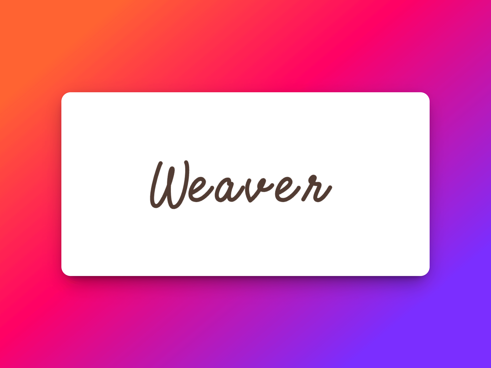

# Weaver

[](https://deepwiki.com/supuwoerc/weaver)

简单的管理系统，麻雀虽小，五脏俱全。

<br />

<p align="center">
   
</p>
<p align="center">
完整的项目文档和开发过程
<br />
<a href="https://supuwoerc.github.io/docs/#%e4%bb%8e%e9%9b%b6%e6%9e%84%e5%bb%bagin%e6%9c%8d%e5%8a%a1"><strong>项目文档</strong></a>
</p>

## 目录

- [上手指南](#上手指南)
    - [开发前的配置要求](#开发前的配置要求)
    - [安装步骤](#安装步骤)
- [文件目录说明](#文件目录说明)
- [开发的架构](#开发的架构)
- [部署](#部署)
- [使用到的框架](#使用到的框架)
- [贡献者](#贡献者)
    - [如何参与开源项目](#如何参与开源项目)
- [版本控制](#版本控制)
- [作者](#作者)
- [鸣谢](#鸣谢)

### 上手指南

请将所有链接中的“shaojintian/Best_README_template”改为“your_github_name/your_repository”


###### 开发前的配置要求

1. pre-commit
2. gocov
3. gocov-html

###### **安装步骤**

1. Get a free API Key at [https://example.com](https://example.com)
2. Clone the repo

```sh
git clone https://github.com/shaojintian/Best_README_template.git
```

### 文件目录说明
eg:

```
filetree 
├── ARCHITECTURE.md
├── LICENSE.txt
├── README.md
├── /account/
├── /bbs/
├── /docs/
│  ├── /rules/
│  │  ├── backend.txt
│  │  └── frontend.txt
├── manage.py
├── /oa/
├── /static/
├── /templates/
├── useless.md
└── /util/

```


### 开发的架构

请阅读[ARCHITECTURE.md](https://github.com/shaojintian/Best_README_template/blob/master/ARCHITECTURE.md) 查阅为该项目的架构。

### 部署

暂无

### 使用的技术栈

- [GIN](https://getbootstrap.com)
- [GORM](https://jquery.com)

#### 如何参与此项目

贡献使开源社区成为一个学习、激励和创造的绝佳场所。你所作的任何贡献都是有意义的。

1. Fork这个项目
2. 创建你自己的功能分支 (`git checkout -b feature/amazing_feature`)
3. 提交你的代码 (`git commit -m 'add some amazing_feature'`)
4. 推送你的代码 (`git push origin feature/amazing_feature`)
5. 创建合并请求

### 版本控制

该项目使用Git进行版本管理。您可以在repository参看当前可用版本。

### 作者

[Idris Email](mailto:zhangzhouou@gmail.com)

*您也可以在贡献者名单中参看所有参与该项目的开发者。*

### 版权说明

该项目签署了MIT 授权许可，详情请参阅 [LICENSE.txt](https://github.com/supuwoerc/weaver/blob/main/LICENSE)


